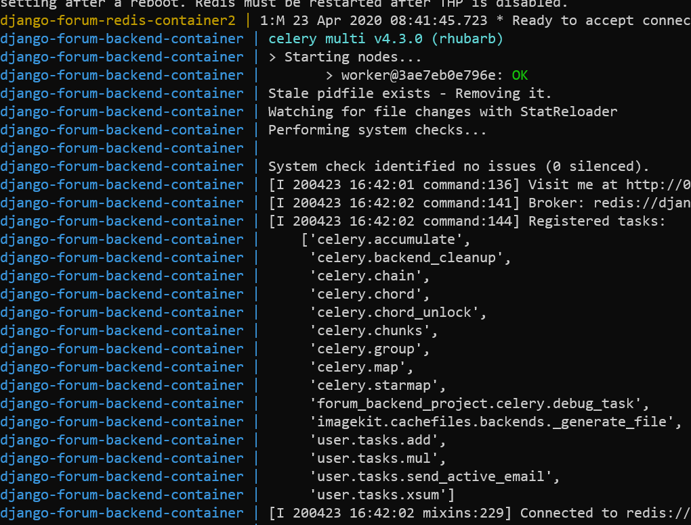
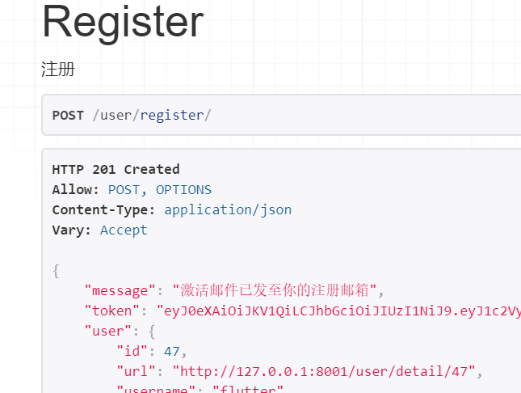
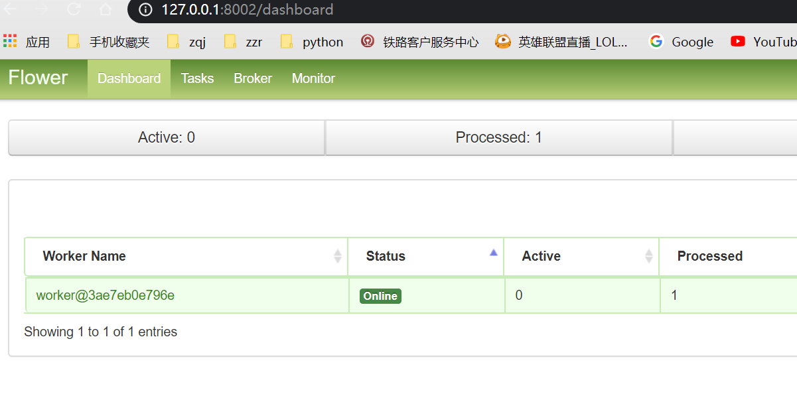
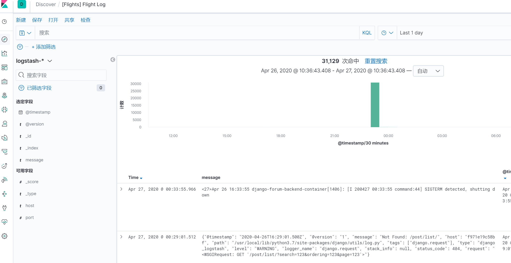
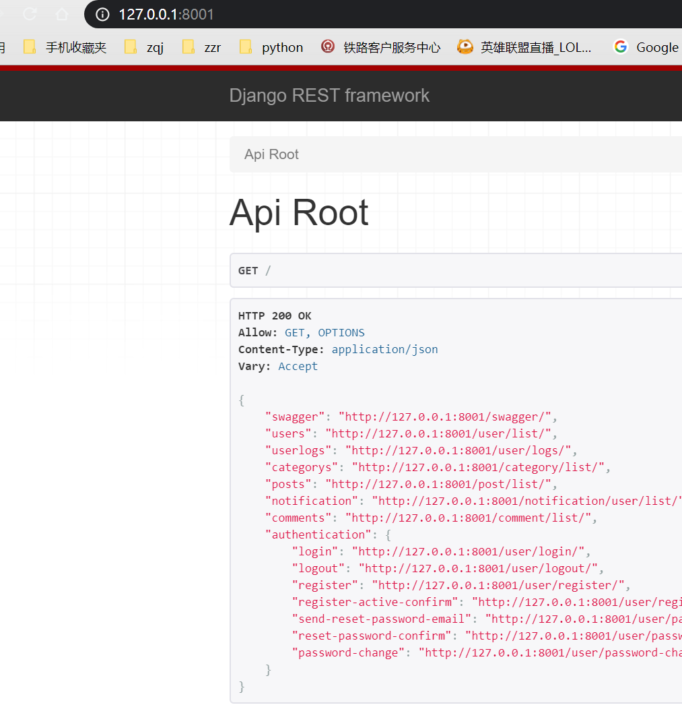
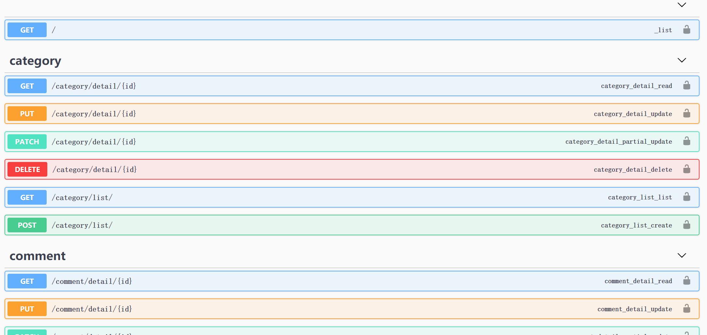
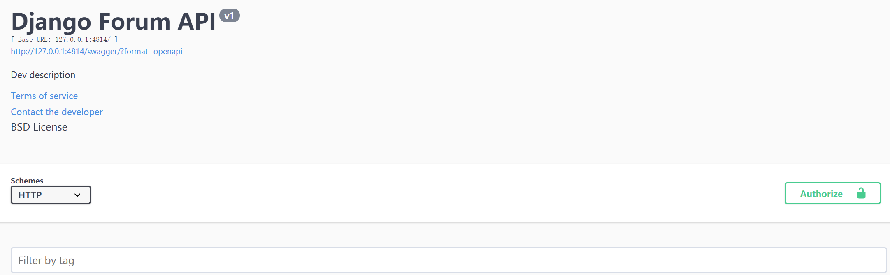

> ### 介绍

功能比较基础，没有一些太复杂的业务，可以用来二次开发，或者直接用来当做类似flaskbb 这种小型论坛后端应用，后续我会继续持续跟进这个项目，如果有什么好的提议或者新功能想法可以向我反馈

#### 功能

1.基本的论坛业务逻辑  
2.基本的用户业务逻辑  
3.基本的鉴权  
4.采用Celery做分布式任务
5.Swagger UI (Open API)

> ### 作为参考（学习）

使用了DRF作为前后端分离框架，而且使用jwt+session来做身份验证，需要对这部分有一定基础，建议萌新去刷一遍DRF的官方指导教程，视图主要采用ViewSet方式来实现，路由没有用DRF官方给的Router来构建路由（后续可能会改用）。在
authentication部分，我参考了django-rest-auth的源码，尤其是serializer和view部分，并额外加入了部分判断逻辑


> ### 部署

1. docker-compose 部署  

    执行docker-compose-deploy.yaml
    ```
    docker-compose -f docker-compose-deploy.yaml up 
    ```

1. 部署到k8s

    参考 kubernetes_resources 目录  
    [kubernetes_resources](kubernetes_resources/README.md)

> ### docker-compose 测试开发运行
Clone repo 并运行
```
docker-compose up
```
浏览器打开  
localhost:8001  
localhost:8002  

部分截图：




> ### Vscode开发模式
安装VScode remote-container插件

在.devcontainer目录里 已将一部分环境搭建好  

按F1 选择 Reopen in container，随后vscode进入容器内部


> ### 运行

```
python manage.py runserver
```

启动celery
```
celery -A forum_backend_project worker -l info -c 1
```

启动flower 监控celery
```
celery -A forum_backend_project flower --address=127.0.0.1 --port=5555
```
localhost:5555 访问监控界面

默认db带了一些测试数据，下面是账号密码

```
# admin account
username:admin
password:zzradmin

# user account
username:zeron
password:zeron123
```

设定环境变量
在forum_backend_project目录下添加一个```forum.env```文件
内容如下

```
DEBUG=on
# 开启ELK
ELK=off
ELK_LOGSTASH_HOST=x.x.x.x
ELK_LOGSTASH_PORT=5000

SECRET_KEY='z+t#k)!z6bi7nk&lv#-ppbf69y@u=wa5l+cx@de4=o!8$*&4!p'
# 可以修改数据库，记得migrate
# vscode debug mode
# DATABASE_URL='sqlite:///./forum_backend/db.sqlite3'

# normal mode
DATABASE_URL='sqlite:///./db.sqlite3'

# vscode debug mode
# DATABASE_URL='sqlite:///./forum_backend/db.sqlite3'

# normal mode
# DATABASE_URL='sqlite:///./db.sqlite3'

# depoly mode (use docker-compose-deploy)
# DATABASE_URL='mysql://admin:zzradmin@db:3306/forum'

# Celery settings
CELERY_REDIS_URL='redis://django-forum-redis:6379/0'

# Eamil Settings
# 更换你要使用的邮件服务商
EMAIL_HOST='**'
EMAIL_PORT=**
# 更换你的邮箱
EMAIL_HOST_USER='****' 
# 更换你的密码
EMAIL_HOST_PASSWORD='****'
EMAIL_SUBJECT_PREFIX='django-forum-email'

```

> ### 启动ELK
修改你环境变量 ```ELK=on```  
cd docker-elk

```
docker-compose up -d
```
具体其他设定请查看[docker-elk](https://github.com/deviantony/docker-elk)

> ### API Root

```
    "users": "http://127.0.0.1:8000/user/list/",
    "userlogs": "http://127.0.0.1:8000/user/logs/",
    "categorys": "http://127.0.0.1:8000/category/list/",
    "posts": "http://127.0.0.1:8000/post/list/",
    "notification": "http://127.0.0.1:8000/notification/user/list/",
    "comments": "http://127.0.0.1:8000/comment/list/",
    "authentication": {
        "login": "http://127.0.0.1:8000/user/login/",
        "logout": "http://127.0.0.1:8000/user/logout/",
        "register": "http://127.0.0.1:8000/user/register/",
        "register-active-confirm": "http://127.0.0.1:8000/user/register/active-confirm/",
        "send-reset-password-email": "http://127.0.0.1:8000/user/password-reset/",
        "reset-password-confirm": "http://127.0.0.1:8000/user/password-reset/confirm/",
        "password-change": "http://127.0.0.1:8000/user/password-change/"
    }
```

> ### Swagger UI
http://127.0.0.1:8000/swagger/



> ## API文档

如显示```JWT_required：true```的请求需要在请求头部添加如下
```
{
    "Authorization":"Bearer <user-token>"
}
```


> ### 用户模块


#### `/user/list/`

方法：GET  
可选参数：无  
权限：admin  
描述：查看所有已注册的用户  
**JWT_required：true**

#### `/user/detail/<int:id>`

方式：GET  
可选参数：无  
权限：所有人
描述：查询某个用户信息  

---
方式：PUT  
可选参数：无  
权限：该User所属用户  
描述：修改个人信息  
**JWT_required：true**  
格式：
```
{
    "nickname": "",
    "avatar": "http://127.0.0.1:8000/media/avatar/7c34fd360865a0ac84ed4c04099a7a06.jpg",
    "description": ""
}
```

#### `/user/logs/`

方式：GET  
可选参数：
```
page # 指定当前页(默认一页显示20个)
page_size # 指定一页显示多少个(max=200)
```
权限:admin  
描述：查看用户日志  
**JWT_required：true** 

#### `/user/logs/<user-id>`

方式：GET  
可选参数：
```
page # 指定当前页(默认一页显示20个)
page_size # 指定一页显示多少个(max=200)
```
权限:admin  
描述：查看用户日志,当user-id为0时代表查询匿名用户日志  
**JWT_required：true**  


> ### 认证模块


#### `/user/login/`

方式：POST  
可选参数：无  
权限:所有人   
描述：用户登陆  
格式：
```
{
    "username": "",
    "email": "",
    "password": ""
}
# note ：username 和 email 只要填一个
```

#### `/user/logout/`

方式：POST  
可选参数：无  
权限:所有人   
描述：用户登出

#### `/user/register/`

方式：POST  
可选参数：无  
权限:所有人   
描述：用户注册  
格式：
```
{
    "username": "",
    "email": "",
    "password1": "",
    "password2": ""
}
```

#### `/user/register/active-confirm/`

方式：POST  
可选参数：无  
权限:所有人   
描述：用户注册激活  
格式：
```
{
    "signature": ""
}
```

#### `/user/password-reset/`

方式：POST  
可选参数：无  
权限:所有人   
描述：发送用户密码重置邮件  
格式：
```
{
    "email": ""
}
```

#### `/user/password-reset/confirm/`

方式：POST  
可选参数：无  
权限:所有人   
描述：用户密码重置提交，uid和token,在邮箱的链接中已给出，前端传入   
格式：
```
{
    "uid": "",
    "token": "",
    "new_password1": "",
    "new_password2": ""
}
```

#### `/user/password-change/`

方式：POST  
可选参数：无  
权限:登陆用户   
描述：更改密码，需要登录后操作  
**JWT_required：true**  
格式：
```
{
    "old_password": "",
    "new_password1": "",
    "new_password2": ""
}
```


> ### 分类模块


#### `/category/list/`

方式：GET  
可选参数：无  
权限:所有人  
描述：获取所有分类

---

方式：POST  
可选参数：无  
权限:admin  
描述：创建新分类
格式：
```
{
    "name": ""
}
```

#### `/category/detail/<int:id>`


方式：GET  
可选参数：无  
权限:admin  
描述：获取分类详情

---

方式：PUT  
可选参数：无  
权限:admin  
描述：修改分类名称
格式：
```
{
    "name": ""
}
```

---

方式：DELETE  
可选参数：无  
权限:admin  
描述：删除分类

> ### 帖子模块

#### `/post/list/`

方式：GET  
可选参数：
```
search:搜索词,可以根据前缀符号来限制搜索，如'^title' 匹配开头，默认是模糊搜索
ordering:排序 ，支持的栏位(views, created, highlighted) or (-views, -created, -highlighted) -符表示倒序
page:页数
page_size:一页的个数
category_id:分类的id，只获取该分类下的帖子
lt_datetime:只获取小于该时间的帖子，格式：%Y-%m-%dT%H:%M:%S
```
权限:所有人  
描述：获取所有帖子

--- 

方式：POST  
可选参数：无  
权限:已登陆用户  
描述：创建一个新帖子  
格式：
```
{
    "category": null,
    "title": "",
    "body": "",
    "voted": false
}
```


#### `/post/detail/<int:id>`

方式：GET  
可选参数：无    
权限:所有人  
描述：获取某个帖子详情


--- 

方式：PUT 
可选参数：无    
权限:admin或者该帖子的author  
描述：更新帖子
格式：
```
{
    "category": "",
    "title": "",
    "body": "",
    "voted": 
}
```

方式：DELETE 
可选参数：无    
权限:admin或者该帖子的author  
描述：删除帖子


> ### 评论模块


#### `/comment/list/`

方式：GET  
可选参数：
```
post_id # 获取指定帖子下的文章
```
权限:所有人  
描述：获取所有评论或者是指定某个帖子下的评论

---

方式：POST  
可选参数：无  
权限:已登陆用户  
描述：发别评论或者回复  
格式：
```
{
    "content": "",
    "object_id": null,
    "nested": false,
    "voted": false,
    "content_type": null
}

# Note： 根据content_type和object_id组合来确认评论哪个帖子或者回复哪个评论
在这个repo数据库里
"content_type": 9代表是评论模型
"content_type": 10代表是帖子模型
```

#### `/comment/detail/<int:id>`

方式：GET  
可选参数：无  
权限:admin    
描述：获取某个评论详情

--- 

方式：PUT 
可选参数：无  
权限:admin  
描述：修改评论
格式：
```
{
    "content": "",
    "object_id": ,
    "nested": ,
    "voted": ,
    "content_type": 
}
```
--- 

方式：DELETE 
可选参数：无  
权限:admin  
描述：删除评论

> ### 通知模块

#### `/notification/user/list/`

方式：GET  
可选参数：无  
权限:已登陆的用户    
描述：只获取自身的通知(已登陆用户)

#### `/notification/detail/<int:id>`

方式：GET  
可选参数：无  
权限:已登陆的用户    
描述：获取某个通知详情

---

方式：PUT  
可选参数：无  
权限:已登陆的用户    
描述：将通知修改为已读，且只能修改为已读
格式：
```
{
    "status": "read",
}
```
--- 

方式：DELETE  
可选参数：无  
权限:已登陆的用户    
描述：删除某个用户通知(软删除)


> ### jwt验证

有些请求没有设置jwt验证，例如通知模块,可以使用以下方式添加  
例如：  
```
from utils.token_required import token_required,method_decorator

    @method_decorator(token_required)
    def update(self, request, *args, **kwargs):
        '''
```
上面显示为修改已读的请求需要在请求头添加token   
在一些情况中，实现jwt则需要子类复写并调用超类方法


> ### Change Log
[2020-5-1]:docker-compose 一键部署 nginx + api + redis + celery + mysql + phpmyadmin  
[2020-4-27]:新增ELK 整合，django日志推送到Elasticsearch ，kibana可视化  
[2020-4-25]:修复在容器内开发时 vscode sqlite3插件不可用 ，现在已经可以直接右键 ```Open Database```查看sqlite3表（底下的SQLITE EXPLORER）  
[2020-4-23]:新增swagger UI ，修复若干个bugs  

> ### 建议反馈

有任何疑问和bug请提交issue或者从下面方式找我  
qq: 506862754  
email: bhg889@163.com 

