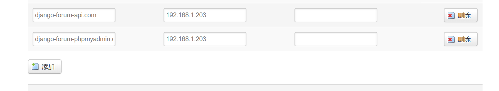
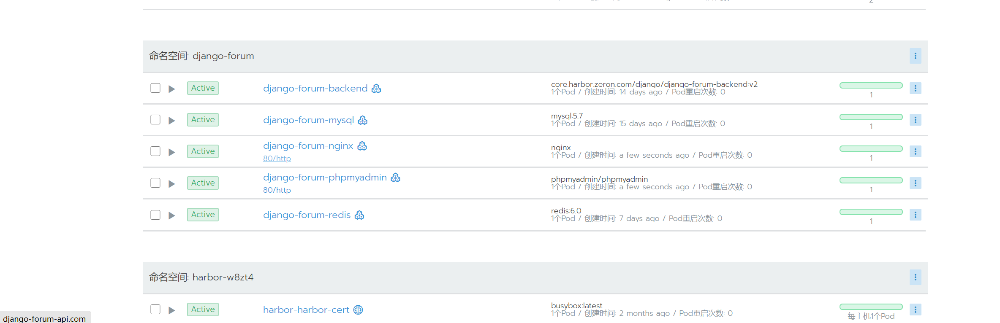
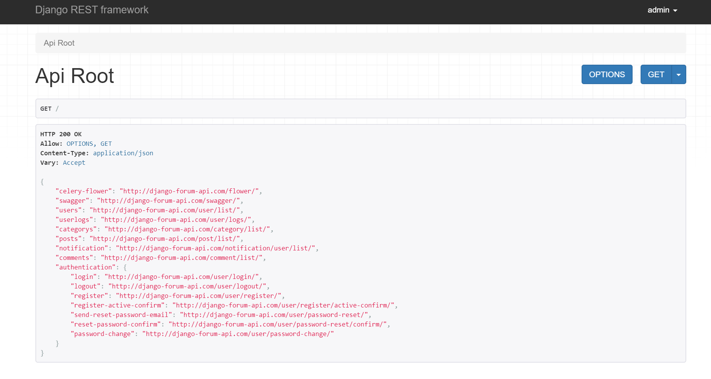
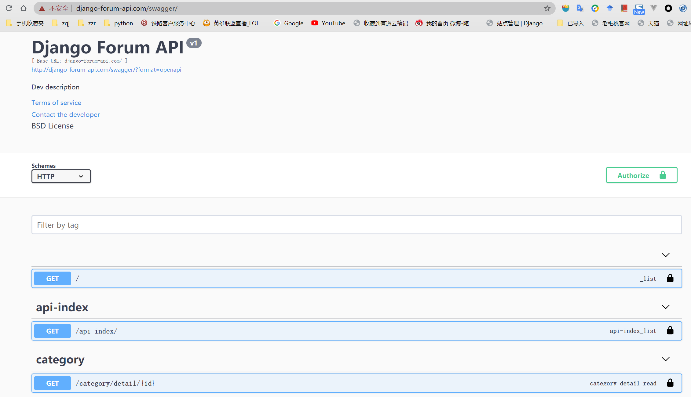
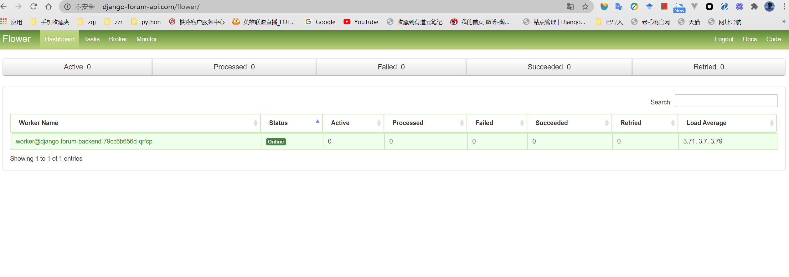
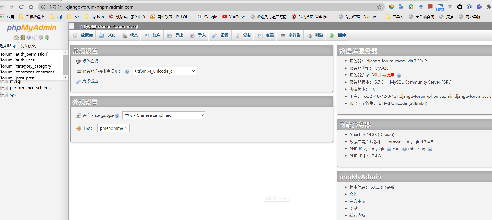

# 部署到Kubernetes

## step 0 (前提条件)
已有kubernetes环境  
已安装存储类，这里使用目前比较流行的nfs解决方案，具体怎么安装请参考https://github.com/helm/charts/tree/master/stable/nfs-client-provisioner,  
先安装nfs server 再使用helm安装 nfs-client 来创建存储类
dns已解析ingress中的域名，如果没有建议将service的```type: ClusterIP```改成```type: NodePort```通过ip加端口进行访问


## step 1 

创建命名空间
```
kubectl create -f namespace.yaml
```

## step 2 

依次执行创建各个组件的yaml   

#### redis -> mysql -> phpmyamdin -> api -> nginx

```
kubectl apply -f redis/redis.yaml

kubectl apply -f mysql/mysql.yaml

kubectl apply -f phpmyadmin/phpmyadmin.yaml

kubectl apply -f api/api.yaml

kubectl apply -f nginx/nginx.yaml
```

## 展示图 
本地集群 使用 rancher UI管理平台

### 路由器openwrt 设定dns



### Rancher UI



### django-rest-framework ui



### django swagger ui



### celery flower ui



### phpadmin ui




## Warning 

mysql 和 redis 作为后端存储应该使用更加可靠的安装方式，例如有状态应用，本项目只做演示，这里我推荐使用bitnami 的helm 安装  
https://github.com/bitnami/charts/tree/master/bitnami